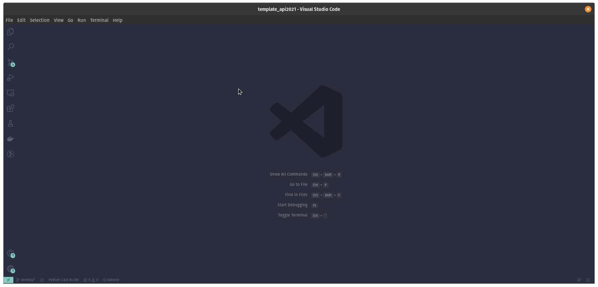
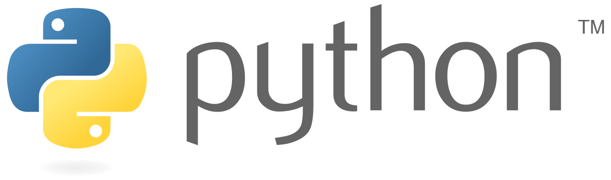
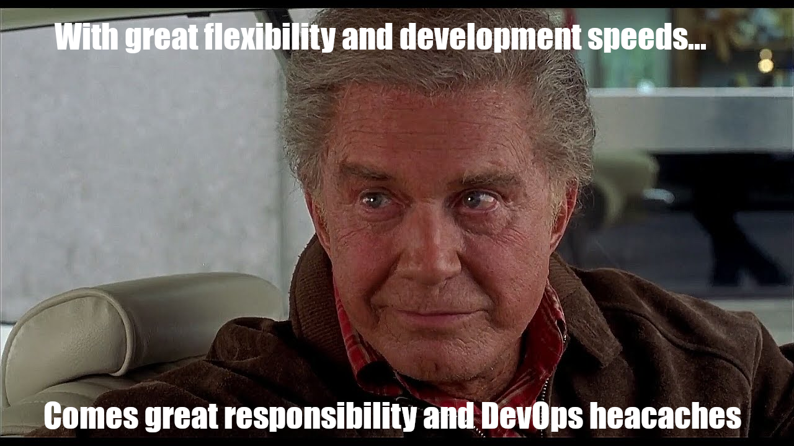
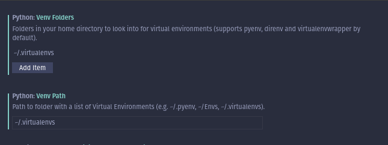

# Developer Environment 2021
Source: https://www.alexpdr.com/env-2021/

Personally I have always been the type to tinker with my setup, there is always new ways of working and tools that can assist (or distract) from in *actually getting the work done*. To balance the time spent getting things *juuuust right* I limit environment changes to once a quarter. In the meantime, any interesting, new or different tool is noted down so that beneficial improvements & changes aren't missed.

## Target Development 🎯

The type of development this is targeted at is primarily modern and high and/or application level created with modern architectures, software patterns and practises.

Specifically;

- API Development
- Software Architecture Development
- Web Development (app, server, services)
- Development for decentralized systems (micro-services & server-less)
- Data(base) processing & management

## Integrated Developer Environment ( IDE 💻 )

Few would be suprised to see another developer using VSCode as their primary IDE, there might be as many developer blog posts on the matter as there is users of it, this is not one of those posts.

I ended up with VSCode as my primary IDE for the following summarized reasons:

- Unique functionality in being able to manage and even step into and work from inside a container natively from the IDE. The docker and k8s extensions save me hundreds of keypresses a week.
- Clean user interface allows me to better focus on the code and less on the UI.
- 3 actions is all it takes for me to add, update or remove *literally anything i might need* withing the IDE.
- Real time standardized linting & code analysis support (unlike PEP8 non-compliant PyCharm... [with issues dating back to 2013](https://intellij-support.jetbrains.com/hc/en-us/community/posts/205814499-Reformat-does-not-make-PEP-8-force-compliance))

## Language specific ( Python 🐍 )

The primary development language for last year ended up being Python, and in all likeliness this year will be (nearly) the same. If applied correctly and with certain guidelines in place it allows fully fledged features to be written in the timespan of functions.

***However**...*

*As ol' developer uncle ben used to say:*

_Or was that spiderman? who knows anymore with #lockdown_

It not only allows, but accepts lazy development practises from the developer. Solving ***that*** while assisting, not impeding progress is the target of these extensions, automations & workflow improvements.

*Examples & implementations of the tools mentioned below will be exported to GitHub and continued to be updated there!*

### Extensions

The Essentials:

- **[Python](https://marketplace.visualstudio.com/items?itemName=ms-python.python)**: The official python extension adding support for the language.
- **[Kite AI Auto-complete](https://www.kite.com/)**: It also provides detailed information by lookup and often even examples @mouseover !
- **[TabNine AI Auto-complete](https://www.tabnine.com/install)**: Learns from your input and the workspace, works best with large projects.
- **[Python Test Explorer](https://marketplace.visualstudio.com/items?itemName=LittleFoxTeam.vscode-python-test-adapter):** Integrates seemlessly with PyTest, makes testing a breeze!
- **[Docker](https://marketplace.visualstudio.com/items?itemName=ms-azuretools.vscode-docker)**: Provides seemless integration of docker into VSCode.
- **[GitLens](https://marketplace.visualstudio.com/items?itemName=eamodio.gitlens):** Adds additional git features like in-file git history and markers.

Nice-to-haves:

- **[Bracket Pair Colourizer 2](https://marketplace.visualstudio.com/items?itemName=CoenraadS.bracket-pair-colorizer-2):** Simple addon that makes working with nesten data types in any format a heck of a lot easier.
- **[Jinja](https://marketplace.visualstudio.com/items?itemName=wholroyd.jinja)**: Adds jinja language support to vscode.
- **[Jinja2 Snippet Kit](https://marketplace.visualstudio.com/items?itemName=WyattFerguson.jinja2-snippet-kit):** Adds a bunch of handy generation snippets for common implementations.
- **[Remote Containers](https://marketplace.visualstudio.com/items?itemName=ms-vscode-remote.remote-containers)**: It allows you to step into containers using VSCode, allow you to run native debugging from inside the container.

Aesthetics *(if you spend 8h+ a day looking at your IDE...)*

- **[Material Icon Theme](https://marketplace.visualstudio.com/items?itemName=PKief.material-icon-theme)**: Adds logos/icons for all common filetypes and languages
- **[Community Material Theme](https://marketplace.visualstudio.com/items?itemName=Equinusocio.vsc-community-material-theme)**: Community driven versions of the material theme(s).
- **[Fira Code Font + Font Ligatures](https://github.com/tonsky/FiraCode/wiki)**: Makes the code easier to read and consume less space on the screen.

### Settings

Personally I try to keep my settings project/workspace specific, but I can highly recommend setting the `Venv` paths and to maintain a best practise of keeping a designated location for your virtual environments such as `~/.virtualenvs/{project_name}`. This allows for both cleaner and easier management and auto-detection of new envs by the IDE.

### Tasks (configurations for you PyCharmer's)

In the world of VSCode, Tasks are generic automations allow you to run pre-defined "tasks" which are series of pre-defined actions such as building a container, running tests or deploying a new package.

They can be incredibly useful for standardizing ways to test and manage your codebase, but are very much project specific. Therefore the I'd refer to the [official documentation](https://code.visualstudio.com/docs/editor/tasks) for details and examples.

## Debugging

In order to make debugging easier VSCode allows you to create pre-defined "launch" files allows you to run certain steps or parts of your code before starting the debugging session.

However, this is not something you necessarily have to configure yourself! When running debugging for the first time in any new workspace/project VSCode will generate a starter file for you based of the type of technologies it detects and the selection you make in the debugging prompt.

For larger, more advanced or complex projects you can add step-by-step instructions in the `.vsocde/launch.json` file. This can be repeated for different environments or debugging scenarios and utilized by extensions like the remote container explorer.

## Testing

In general with any Python projects you want to include some sort of unit testing, however this can be quite a daunting task with the amount of available tools, especially when the quality of them differs drastically.

To minimize the amount of manual input while maximizing the code coverage I combine **four** different tools, each handling one part of the testing with an external Postman collection for manual debuggin.

*All of these tests can be run as Tasks or via the Test Explorer.*
(*You should always get the latest version of these directly from [pypi](https://pypi.org/)*)

- **[Flake8](https://pypi.org/project/flake8/)**: integrates natively with vscode to provide realtime syntax linting that ensures compliance with PEP8
- **Black**: auto-formatter that automatically formats flake8/pep8 compliant code.
- **[PyTest](https://pypi.org/project/pytest/)** (+extension [pytest-cov](https://pypi.org/project/pytest-cov/)): provides a testing framework to run standard python unit tests and any framework built on top of it.
- **[WebTest](https://pypi.org/project/WebTest/)**: extends unittest to provide additional testing methods to test common Web/API use cases like endpoints, statuscodes, payload content etc.

Extra Testing Resources

We all know testing is important, for my work with services and API's both [Stoplight](https://stoplight.io/) for creation & design and [Postman](https://www.postman.com/) for documentation & testing of (Open)API's and distributed services/functions has been ivaluable.

*(Both tools deserve and will probably get their post eventually!)*

## Apps

[content/photo-1480694313141-fce5e697ee25](content/photo-1480694313141-fce5e697ee25)

Photo by Rami Al-zayat / Unsplash

The more work we can have tools do for us, the more features & value we can create as software developers. It's therefore not just important, but essential that we don't spend time fighting the technology we're trying to implement, develop and deploy.

### General

- **[GitKraken](https://www.gitkraken.com/)**: The fastest, most user-friendly and most feature-complete git client available. It makes git drag & drop and approachable by anyone from absolute beginner to CLI savant.
- **[Terminus](https://eugeny.github.io/terminus/)**: Highly automateable multi-platform terminal emulator. Allows for tab, env and custom profiles, supports SSH and packs tons of other power-user tools into a nice compact UI.

### API's & MicroServices

- **[Stoplight Studio](https://stoplight.io/)**: Allows for designing, creating, linting and validating of OpenAPI 3.0 schema's in either JSON or YAML with ease.
- **[Postman](https://www.postman.com/)**: Provides an all-in-one solution for API's, deployed as a "functional" documentation on top of your API schema it allows for environment based API testing, runbook-style examples. For teams it's recommended keeping one Read-only version on the team workspace and members copy it to their personal workspace before testing, debugging & other usage.
- **[Dockstation](https://dockstation.io/):** All-in-one solution for managing `docker` and `docker-compose` development on a local or remote machine. *(and it's open-source!)*

### Databases

- **[TablePlus](https://tableplus.com/)**: if you do development on a Mac or Windows then this is by far the most powerful and clean database manager out there. It allows you to work with the data using common UI actions, filters and other automations & niceties instead of writing lists of pre-defined SQL queries. *(It runs on linux as well, but [omniDB](https://omnidb.org/) might be a better option there until development goes further!)*

### Commandline

- **[Terminus](https://eugeny.github.io/terminus/):** A multi-platform generic terminal that allows dynamic scripting and SSH profile definitions. I.E. each tab can run a unique shell and/or shell profile.
- **[OhMyZSh](https://github.com/ohmyzsh/ohmyzsh)**: Updates the terminal from ~2000 to ~2020 (requires `ZSh` to be installed separately!)
- **[GitHub CLI](https://github.com/cli/cli):** Adds the ability to directly interact with your GitHub account from the command line. *(Works great with gists!)*

### Architecture & Design

- **[Draw.io](https://app.diagrams.net/)**: now known simply as *diagrams.net* is free generic diagram tool with components for close to every single use-use case. If not included by default it allows any image or SVG or be simply drag & dropped into position.
- **[Figma](https://www.figma.com/)**: the only real non-platform specific option for design that's not Adobe. Alternatively, if you have access to an apple device, *use [sketch](https://www.sketch.com/).*

Tooling can often seem overbearing or like overhead, but it's in those times it's important to remember:

> Half an hour spent in tooling, workflows & automations now can save your hours if not days of development time over the course of a project

Over the next couple of posts I will be further building on this "local" development environment with additional cheap or outright open-source tools that aim to help you and your team to take development *to the next level by impleneting:*

- CI/CD pipeline for automated analysis, testing, build and deployment.
- Templating and automation for developer and product documentation.
- Automated workflows for hosting, securing & monitoring app deployments

In such a way that it can be replicated, duplicated or adapated for any other project in ***an hour or less.***